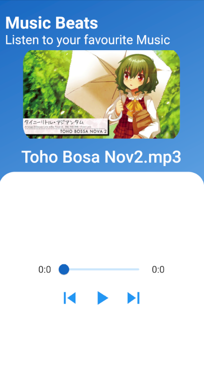
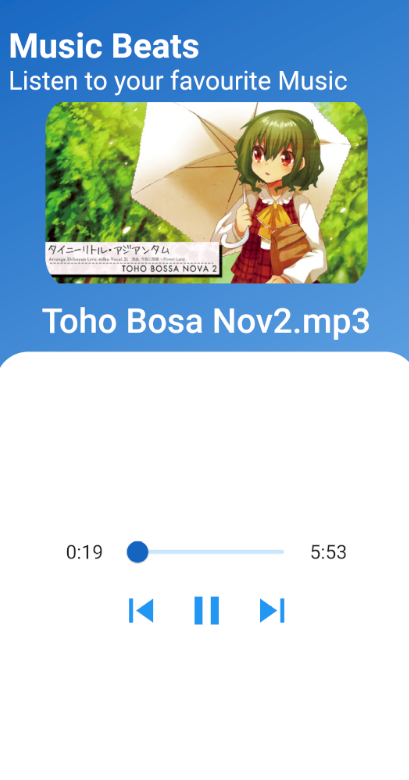

## Getting Started  
  
This project is play mp3 files at Android using a Flutter application.  
  
A resources to get you create music player Flutter project:  
  
- [ Music Player App using Flutter](https://www.youtube.com/watch?v=aZiuSBpnU5g&t=6s)  
  
For help getting started with Flutter, view our  
[online documentation](https://flutter.dev/docs), which offers tutorials,  
samples, guidance on mobile development, and a full API reference.

## Screen shot
|Started App|  Playing app| 
|---|---|